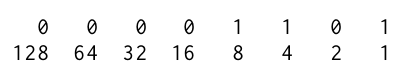

# Progrmación javascript
 
A continuación se presenta un resumen del libro eloquent javascript,
donde se encontrarán conceptos e información más destacada.


Cuando la acción deja de servirte, reúne información; cuando la  información deja de servirte, duerme..
*—Ursula K. Le Guin, La Mano Izquierda De La Oscuridad*


## Conceptos Básicos

**Programaciòn:**  Es el acto de construir un programa - un conjunto
de instrucciones precisas que le dicen a una computadora que hacer.

**Còdigo:**  Es el texto que componen los programas.


## Historia de javascript
Javascript  esta integrado en cada navegador web moderno,
y por lo tanto esta disponible en casi todos los dispositivos. Este lenguaje usa el estandard ECMAScript.

Ha echo que las aplicaciones web modernas sean posibles, ya que aplicaciones con las que puedes interactuar ,
sin hacer una recarga de la página para cada acción a esto se le llama **interactividad**.

# Capitulo 1: Valores, tipos y operadores

Los datos son representados por bits, un bit es presentado por 0 y 1 formado por 8 digitos.



Por ejemplo el número 13 esta representado en binario por 00001101, ya que 8 + 4 + 1 ,
es 13.


## Valores

Todos los valores estan formados por bits que juegan papeles diferentes. Cada valor tiene un tipo que determina su rol 
pueden ser números,pedazos de texto,funciones y asi sucesivamente.


Para llamar un valor solo se invoca su nombre, se almacenan en algun sitio de la memoria RAM.


## Nùmeros

Javascript utiliza valores de tipo number, los cuales utilizan especificamente 64 bits 
para poder alamacenar un solo valor nùmerico de tipo number, estos son por ejemplo:
* 5
* 13.4
* -4.9
* trillones(15 ceros)
* 2.989e8

### Aritmètica

Con los datos de tipo number se realizan operaciones aritmèticas como:
*suma,resta,multiplicaciòn,divisiòn y exponentes*.

Para realizar operaciones se usan signos a los que se les conoce como **operadores**:
suma(+), resta(-), multiplicaciòn(*), divisiòn(/) y residuo o modulo(%).

```javascript
let suma = 4 + 5
console.log(suma)
-> 9
```

Recuerda que se usa:
* _Precedencia de operaciones:_ primero se realizaràn las divisiòn,multiplicaciòn y residuo. Despues las restas y sumas.
* _Tàmbien se respetan los parentesis_
* _En caso de no tener de realizan las operaciones de izquierda a derecha_

### Nùmeros especiales

Existen 3 valores especiales que no se comportan como números normales.
No se debe confiar mucho en estos valores ya que probablemente te puede dar un Nan(not a number)
* Infinity Infinidades: positivas
* -Infinity Infinidades: negativas


## Strings